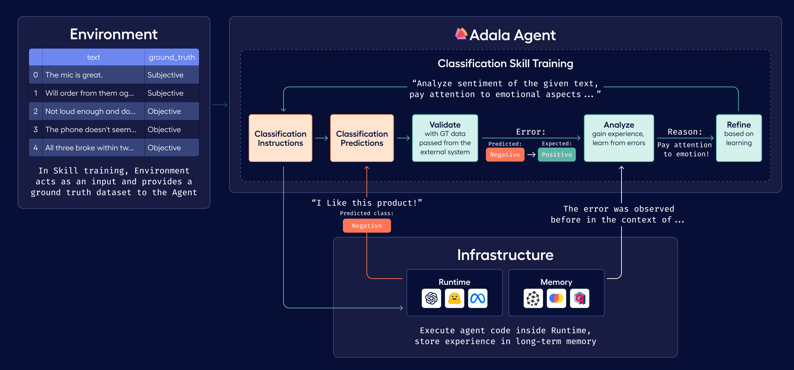
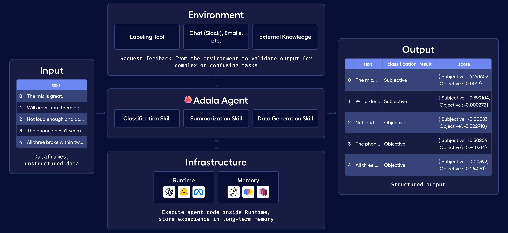

# CI TEST
[](https://badge.fury.io/py/adala)


[](https://discord.gg/QBtgTbXTgU)

<picture>
  <source media="(prefers-color-scheme: dark)" srcset="/docs/src/img/logo-dark-mode.png" width="275" >
  <source media="(prefers-color-scheme: light)" srcset="/docs/src/img/logo.png" width="275" >
  
</picture>

Adala is an **A**utonomous **DA**ta (**L**abeling) **A**gent framework.

Adala offers a robust framework for implementing agents specialized in data processing, with an emphasis on
diverse data labeling tasks. These agents are autonomous, meaning they can independently acquire one or more skills
through iterative learning. This learning process is influenced by their operating environment, observations, and
reflections. Users define the environment by providing a ground truth dataset. Every agent learns and applies its skills
in what we refer to as a "runtime", synonymous with LLM.



<!-- Offered as an HTTP server, users can interact with Adala via command line or RESTful API, and directly integrate its features in Python Notebooks or scripts. The self-learning mechanism leverages Large Language Models (LLMs) from providers like OpenAI and VertexAI. -->

## 📢 Why choose Adala?

- 🌟 **Reliable agents**: Agents are built upon a foundation of ground
  truth data. This ensures consistent and trustworthy results, making Adala a
  reliable choice for your data processing needs.
  
- 🎮 **Controllable output**: For every skill, you can configure the
  desired output and set specific constraints with varying degrees of
  flexibility. Whether you want strict adherence to particular
  guidelines or more adaptive outputs based on the agent's learning,
  Adala allows you to tailor results to your exact needs.

- 🎯 **Specialized in data processing**: While agents excel in diverse
  data labeling tasks, they can be customized for a wide range of data
  processing needs.
  
- 🧠 **Autonomous learning**: Adala agents aren't just automated;
  they're intelligent. They iteratively and independently develop
  skills based on environment, observations, and reflections.

- ✅ **Flexible and extensible runtime**: Adala's runtime environment is
  adaptable. A single skill can be deployed across multiple runtimes,
  facilitating dynamic scenarios like the student/teacher
  architecture. Moreover, the openness of framework invites the
  community to extend and tailor runtimes, ensuring continuous
  evolution and adaptability to diverse needs.
  
- 🚀 **Easily customizable**: Quickly customize and develop agents to address
  challenges specific to your needs, without facing a steep learning curve.

## 🫵 Who is Adala for?

Adala is a versatile framework designed for individuals and professionals in the field of AI and machine learning. Here's who can benefit:

- 🧡 **AI engineers:** Architect and design AI agent systems with modular, interconnected skills. Build production-level agent systems, abstracting low-level ML to Adala and LLMs.
- 💻 **Machine learning researchers:** Experiment with complex problem decomposition and causal reasoning.
- 📈 **Data scientists:** Apply agents to preprocess and postprocess your data. Interact with Adala natively through Python notebooks when working with large Dataframes.
- 🏫 **Educators and students:** Use Adala as a teaching tool or as a base for advanced projects and research.

While the roles highlighted above are central, it's pivotal to note that Adala is intricately designed to streamline and elevate the AI development journey, 
catering to all enthusiasts, irrespective of their specific niche in the field. 🥰

## 🔌Installation

Install Adala:

```sh
pip install adala
```

Adala frequently releases updates. In order to ensure that you are using the most up-to-date version, it is recommended that you install it from GitHub:
```sh
pip install git+https://github.com/HumanSignal/Adala.git
```

Developer installation:
```sh
git clone https://github.com/HumanSignal/Adala.git
cd Adala/
poetry install
```

<!--
If you're planning to use human-in-the-loop labeling, or need a labeling tool to produce ground truth datasets, we
suggest installing Label Studio. Adala supports Label Studio format out of the box.

```sh
pip install label-studio
```
-->

## 📝 Prerequisites

Set OPENAI_API_KEY ([see instructions here](https://platform.openai.com/docs/quickstart/step-2-setup-your-api-key))

```
export OPENAI_API_KEY='your-openai-api-key'
```

## 🎬 Quickstart

In this example we will use Adala as a standalone library directly inside Python notebook.

Click [here](./examples/quickstart.ipynb) to see an extended quickstart example. 

```python
import pandas as pd

from adala.agents import Agent
from adala.environments import StaticEnvironment
from adala.skills import ClassificationSkill
from adala.runtimes import OpenAIChatRuntime
from rich import print

# Train dataset
train_df = pd.DataFrame([
    ["It was the negative first impressions, and then it started working.", "Positive"],
    ["Not loud enough and doesn't turn on like it should.", "Negative"],
    ["I don't know what to say.", "Neutral"],
    ["Manager was rude, but the most important that mic shows very flat frequency response.", "Positive"],
    ["The phone doesn't seem to accept anything except CBR mp3s.", "Negative"],
    ["I tried it before, I bought this device for my son.", "Neutral"],
], columns=["text", "sentiment"])

# Test dataset
test_df = pd.DataFrame([
    "All three broke within two months of use.",
    "The device worked for a long time, can't say anything bad.",
    "Just a random line of text."
], columns=["text"])

agent = Agent(
    # connect to a dataset
    environment=StaticEnvironment(df=train_df),

    # define a skill
    skills=ClassificationSkill(
        name='sentiment',
        instructions="Label text as positive, negative or neutral.",
        labels={'sentiment': ["Positive", "Negative", "Neutral"]},
        input_template="Text: {text}",
        output_template="Sentiment: {sentiment}"
    ),

    # define all the different runtimes your skills may use
    runtimes = {
        # You can specify your OPENAI API KEY here via `OpenAIRuntime(..., api_key='your-api-key')`
        'openai': OpenAIChatRuntime(model='gpt-3.5-turbo'),
    },
    default_runtime='openai',
    
    # NOTE! If you have access to GPT-4, you can uncomment the lines bellow for better results
#     default_teacher_runtime='openai-gpt4',
#     teacher_runtimes = {
#       'openai-gpt4': OpenAIRuntime(model='gpt-4')
#     }
)

print(agent)
print(agent.skills)

agent.learn(learning_iterations=3, accuracy_threshold=0.95)

print('\n=> Run tests ...')
predictions = agent.run(test_df)
print('\n => Test results:')
print(predictions)
```

### 👉 Examples
| Skill                                                                              | Description                                                                       | Colab                                                                                                                                                                                                                                        |
|------------------------------------------------------------------------------------|-----------------------------------------------------------------------------------|----------------------------------------------------------------------------------------------------------------------------------------------------------------------------------------------------------------------------------------------|
| [ClassificationSkill](./examples/classification_skill.ipynb)                 | Classify text into a set of predefined labels.                                    | <a target="_blank" href="https://colab.research.google.com/github/HumanSignal/Adala/blob/master/examples/classification_skill.ipynb"> </a>          |
| [ClassificationSkillWithCoT](./examples/classification_skill_with_CoT.ipynb) | Classify text into a set of predefined labels, using Chain-of-Thoughts reasoning. | <a target="_blank" href="https://colab.research.google.com/github/HumanSignal/Adala/blob/master/examples/classification_skill_with_CoT.ipynb"> </a> |
| [SummarizationSkill](./examples/summarization_skill.ipynb)                   | Summarize text into a shorter text.                                               | <a target="_blank" href="https://colab.research.google.com/github/HumanSignal/Adala/blob/master/examples/summarization_skill.ipynb"> </a>           |
| [QuestionAnsweringSkill](./examples/question_answering_skill.ipynb)          | Answer questions based on a given context.                                        | <a target="_blank" href="https://colab.research.google.com/github/HumanSignal/Adala/blob/master/examples/question_answering_skill.ipynb"> </a>      |
| [TranslationSkill](./examples/translation_skill.ipynb)                       | Translate text from one language to another.                                      | <a target="_blank" href="https://colab.research.google.com/github/HumanSignal/Adala/blob/master/examples/translation_skill.ipynb"> </a>             |
| [TextGenerationSkill](./examples/text_generation_skill.ipynb)                | Generate text based on a given prompt.                                            | <a target="_blank" href="https://colab.research.google.com/github/HumanSignal/Adala/blob/master/examples/text_generation_skill.ipynb"> </a>         |
| [Skill sets](./examples/skillsets_sequence_of_skills.ipynb)                  | Process complex tasks through a sequence of skills.                               | <a target="_blank" href="https://colab.research.google.com/github/HumanSignal/Adala/blob/master/examples/skillsets_sequence_of_skills.ipynb"> </a>  |
| [OntologyCreator](./examples/ontology_creator.ipynb)                         | Infer ontology from a set of text examples.                                       | <a target="_blank" href="https://colab.research.google.com/github/HumanSignal/Adala/blob/master/examples/ontology_creator.ipynb"> </a>              |
| [Math reasoning](./examples/gsm8k_test.ipynb)                                 | Solve grade-school math problems on GSM8k dataset.                                | <a target="_blank" href="https://colab.research.google.com/github/HumanSignal/Adala/blob/master/examples/gsm8k_test.ipynb"> </a>                    |



<!-- 
## 📒 More notebooks

- [Quickstart](./adala/examples/quickstart.ipynb) – An extended example of the above with comments and outputs.
- [Creating New Skill (coming soon!)](./adala/examples/creating_new_skill.ipynb) – An example that walks you through creating a new skill.
- [Label Studio Tutorial (coming soon!)](examples/tutorial_label_studio.ipynb) – An example of connecting Adala to an external labeling tool for enhanced supervision.
-->
<!-- 
## Running ADALA as a standalone server (Coming soon!)

Initiate the Adala server. Note: Each agent operates as its own web server.

### Starting the Adala Server

```sh
# Start the Adala server on default port 8090
adala start
```

### Uploading Ground Truth Data

Before teaching skills to Adala, you need to set up the environment and upload data.

```sh
# Upload your dataset
adala upload --file sample_dataset_ground_truth.json
```

### Teaching Skills to Adala

Now, define and teach a new skill to Adala.

```sh
# Define a new skill for classifying objects
adala add-skill --name "Object Classification" --description "Classify text into categories." --instruction "Example: Label trees, cars, and buildings."
```

```sh
# Start the learning process
adala learn --skill "Object Classification" --continuous
```

### Monitoring Optimization

Track the progress of the optimization process.

```sh
# Check the optimization status
adala status
```

### Applying Skills and Predictions

You don't need to wait for optimization to finish. Instruct Adala to apply its skills on new data outside the
environment, turning Adala into a prediction engine. If the predictions generated by the skill are then verified by
human validators or another supervision system, this provides more ground truth data, enhancing the agent's skills. Use
the learned skills and generate predictions.

```sh
# Apply the 'Object Classification' skill on new data
adala apply-skill --name "Object Classification" --file sample_dataset_predict.json
```

### Review Metrics

Get insights into Adala's performance.

```sh
# View detailed metrics
adala metrics
```

## Executing ADALA Command Line

```sh
# Start the Adala server on default port 8090
adala start --port 8090

# Upload your dataset
adala upload --file sample_dataset_ground_truth.json

# Define a new skill for classifying objects
adala add-skill --name "Object Classification" --description "Classify images into categories." --instruction "Example: Label trees, cars, and buildings."

# Start the learning process
adala learn --skill "Object Classification"

# Check the optimization status
adala status

# Apply the 'Object Classification' skill on new data
adala apply-skill --name "Object Classification" --file sample_dataset_predict.json

# View detailed metrics
adala metrics

# Restart the Adala server
adala restart

# Shut down the Adala server
adala shutdown

# List all the skills
adala list-skills

# List all the runtimes
adala list-runtimes

# Retrieve raw logs
adala logs

# Provide help
adala help <command>
```
-->

## 🗺 Roadmap

- [x] Low-level skill management (i.e. agent.get_skill("name")) [COMPLETE @niklub]
- [ ] Make every notebook example to run in Google Collab and add a badge into README
- [ ] Extend environment with one more example
- [ ] Multi-task learning (learn multiple skills at once)
- [ ] Calculate and store top line Agent metrics (predictions created, runtime executions, learning loops, etc)
- [ ] Create Named Entity Recognition Skill
- [ ] Command line utility (see the source for this readme for example)
- [ ] REST API to interact with Adala
- [ ] Vision and multi-modal agent skills

## 🤩 Contributing to Adala

Enhance skills, optimize runtimes, or pioneer new agent types. Whether you're
crafting nuanced tasks, refining computational environments, or sculpting specialized agents for unique domains, your
contributions will power Adala's evolution. Join us in shaping the future of intelligent systems and making Adala more
versatile and impactful for users across the globe.

[Read more](./CONTRIBUTION.md) here.

## 💬 Support

Do you need help or are you looking to engage with community? Check out [Discord channel](https://discord.gg/QBtgTbXTgU)!
Whether you have questions, need clarification, or simply want to discuss topics related to the project, the Discord community is welcoming!
