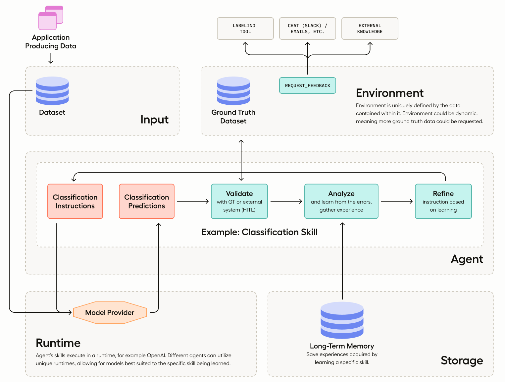

<a href="#"></a>

Adala is an **A**utonomous **DA**ta (**L**abeling) **A**gent framework.

Adala offers a robust framework for implementing agents specialized in data processing, with a particular emphasis on
diverse data labeling tasks. These agents are autonomous, meaning they can independently acquire one or more skills
through iterative learning. This learning process is influenced by their operating environment, observations, and
reflections. Users define the environment by providing a ground truth dataset. Every agent learns and applies its skills
in what we refer to as a "runtime", synonymous with LLM.



<!-- Offered as an HTTP server, users can interact with Adala via command line or RESTful API, and directly integrate its features in Python Notebooks or scripts. The self-learning mechanism leverages Large Language Models (LLMs) from providers like OpenAI and VertexAI. -->

### Why Choose Adala?

- **Reliable Agents**: Built upon a foundation of ground truth data,
  our agents ensure consistent and trustworthy results, making Adala a
  reliable choice for data processing needs.
  
- **Controllable Output**: For every skill, you can configure the
  desired output, setting specific constraints with varying degrees of
  flexibility. Whether you want strict adherence to particular
  guidelines or more adaptive outputs based on the agent's learning,
  Adala allows you to tailor results to your exact needs.

- **Specialized in Data Processing**: While our agents excel in diverse
  data labeling tasks, they can be tailored to a wide range of data
  processing needs.
  
- **Autonomous Learning**: Adala agents aren't just automated;
  they're intelligent. They iteratively and independently develop
  skills based on environment, observations, and reflections.

- **Flexible and Extensible Runtime**: Adala's runtime environment is
  adaptable. A single skill can be deployed across multiple runtimes,
  facilitating dynamic scenarios like the student/teacher
  architecture. Moreover, the openness of our framework invites the
  community to extend and tailor runtimes, ensuring continuous
  evolution and adaptability to diverse needs.
  
- **Extend Skills**: Quickly tailor and develop agents to address the
  specific challenges and nuances of your domain, without facing a
  steep learning curve.

## Installation

Install ADALA:

```sh
git clone https://github.com/HumanSignal/ADALA.git
cd ADALA/
pip install -e .
```

If you're planning to use human-in-the-loop labeling, or need a labeling tool to produce ground truth datasets, we
suggest installing Label Studio. Adala is made to support Label Studio format right out of the box.

```sh
pip install label-studio
```

## Prerequisites

Set OPENAI_API_KEY ([see instructions here](https://platform.openai.com/docs/quickstart/step-2-setup-your-api-key))

```
export OPENAI_API_KEY='your-openai-api-key'
```

## Quickstart

In this example we will use ADALA as a standalone library directly inside our python notebook. You can open it in Collab
right here.

```python
import pandas as pd

from adala.agents import Agent
from adala.datasets import DataFrameDataset
from adala.environments import BasicEnvironment
from adala.skills import ClassificationSkill

df = pd.DataFrame([
    ["The mic is great.", "Subjective"],
    ["Will order from them again!", "Subjective"],
    ["Not loud enough and doesn't turn on like it should.", "Objective"],
    ["The phone doesn't seem to accept anything except CBR mp3s", "Objective"],
    ["All three broke within two months of use.", "Objective"]
], columns=["text", "ground_truth"])

dataset = DataFrameDataset(df=df, input_data_field="text")

agent = Agent(
    # connect to a dataset
    environment=BasicEnvironment(ground_truth_column="ground_truth"),
    # define a skill
    skills=ClassificationSkill(labels=["Subjective", "Objective"]),
)

run = agent.learn(train_dataset=dataset, learning_iterations=3, accuracy_threshold=0.95)

print('=====================')
print(f'New instructions: {run.updated_instructions}')
print('=====================')
print('Predictions:')
print(run.predictions)
```

## More Notebooks

- [Quickstart](./examples/quickstart.ipynb) – An extended example of the above with comments and outputs.
- [Creating New Skill](./examples/creating_new_skill.ipynb) – An example that walks you through creating a new skill.
- [Label Studio Tutorial](examples/tutorial_label_studio.ipynb) – An example of connecting Adala to an external labeling tool for enhanced supervision.

<!-- 
## Running ADALA as a standalone server (Comming soon!)

Initiate the Adala server. Note: Each agent operates as its own web server.

### Starting the Adala Server

```sh
# Start the Adala server on default port 8090
adala start
```

### Uploading Ground Truth Data

Before teaching skills to Adala, you need to set up the environment and upload data.

```sh
# Upload your dataset
adala upload --file sample_dataset_ground_truth.json
```

### Teaching Skills to Adala

Now, define and teach a new skill to Adala.

```sh
# Define a new skill for classifying objects
adala add-skill --name "Object Classification" --description "Classify text into categories." --instruction "Example: Label trees, cars, and buildings."
```

```sh
# Start the learning process
adala learn --skill "Object Classification" --continuous
```

### Monitoring Optimization

Track the progress of the optimization process.

```sh
# Check the optimization status
adala status
```

### Applying Skills and Predictions

You don't need to wait for optimization to finish. Instruct Adala to apply its skills on new data outside the
environment, turning Adala into a prediction engine. If the predictions generated by the skill are then verified by
human validators or another supervision system, this provides more ground truth data, enhancing the agent's skills. Use
the learned skills and generate predictions.

```sh
# Apply the 'Object Classification' skill on new data
adala apply-skill --name "Object Classification" --file sample_dataset_predict.json
```

### Review Metrics

Get insights into Adala's performance.

```sh
# View detailed metrics
adala metrics
```

## Executing ADALA Command Line

```sh
# Start the Adala server on default port 8090
adala start --port 8090

# Upload your dataset
adala upload --file sample_dataset_ground_truth.json

# Define a new skill for classifying objects
adala add-skill --name "Object Classification" --description "Classify images into categories." --instruction "Example: Label trees, cars, and buildings."

# Start the learning process
adala learn --skill "Object Classification"

# Check the optimization status
adala status

# Apply the 'Object Classification' skill on new data
adala apply-skill --name "Object Classification" --file sample_dataset_predict.json

# View detailed metrics
adala metrics

# Restart the Adala server
adala restart

# Shut down the Adala server
adala shutdown

# List all the skills
adala list-skills

# List all the runtimes
adala list-runtimes

# Retrieve raw logs
adala logs

# Provide help
adala help <command>
```
-->

## Roadmap

- [ ] Create Named Entity Recognition Skill
- [ ] Extend Environemnt with one more example
- [ ] Command Line Utility (see the source for this readme for example)
- [ ] REST API to interact with Adala

## Contributing to Adala

Dive into the heart of Adala by enhancing Skills, optimizing Runtimes, or pioneering new Agent Types. Whether you're
crafting nuanced tasks, refining computational environments, or sculpting specialized agents for unique domains, your
contributions will power Adala's evolution. Join us in shaping the future of intelligent systems and making Adala more
versatile and impactful for users across the globe.

[Read more](./CONTRIBUTION.md) here.

## Support

Are you in need of assistance or looking to engage with our community? Our [Discord channel]() is the perfect place for real-time support and interaction. Whether you have questions, need clarifications, or simply want to discuss topics related to our project, the Discord community is welcoming!

## FAQ

- What is an agent?
  - Agent is a set of skills and runtimes that could be used to execute those skills. Each agent has its own unique environment (dataset) attached to it. You can define your own agent class that would have a unique set of skills for your domain.
- What is a skill?
  - Skill is a learned ability to solve a specific task. Skill gets trained from the ground truth dataset.

