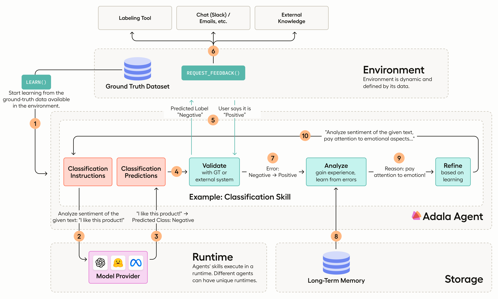

# Quickstart

Adala is an **A**utonomous **DA**ta (**L**abeling) **A**gent framework.

Adala offers a robust framework for implementing agents specialized in data processing, with an emphasis on
diverse data labeling tasks. These agents are autonomous, meaning they can independently acquire one or more skills
through iterative learning. This learning process is influenced by their operating environment, observations, and
reflections. Users define the environment by providing a ground truth dataset. Every agent learns and applies its skills
in what we refer to as a "runtime", synonymous with LLM.




## Installation

Install Adala:

```sh
pip install adala
```

## Prerequisites

Set OPENAI_API_KEY ([see instructions here](https://platform.openai.com/docs/quickstart/step-2-setup-your-api-key))


## 🎬 Quickstart

In this example we will use Adala as a standalone library directly inside Python notebook.

Click [here](https://github.com/HumanSignal/Adala/blob/master/examples/quickstart.ipynb) to see an extended quickstart example. 

```python
import pandas as pd

from adala.agents import Agent
from adala.datasets import DataFrameDataset
from adala.environments import BasicEnvironment
from adala.skills import ClassificationSkill
from adala.runtimes import OpenAIRuntime
from rich import print

# Train dataset
ground_truth_df = pd.DataFrame([
    ["It was the negative first impressions, and then it started working.", "Positive"],
    ["Not loud enough and doesn't turn on like it should.", "Negative"],
    ["I don't know what to say.", "Neutral"],
    ["Manager was rude, but the most important that mic shows very flat frequency response.", "Positive"],
    ["The phone doesn't seem to accept anything except CBR mp3s.", "Negative"],
    ["I tried it before, I bought this device for my son.", "Neutral"],
], columns=["text", "ground_truth"])

# Test dataset
predict_df = pd.DataFrame([
    "All three broke within two months of use.",
    "The device worked for a long time, can't say anything bad.",
    "Just a random line of text."
], columns=["text"])

ground_truth_dataset = DataFrameDataset(df=ground_truth_df)
predict_dataset = DataFrameDataset(df=predict_df)

agent = Agent(
    # connect to a dataset
    environment=BasicEnvironment(
        ground_truth_dataset=ground_truth_dataset,
        ground_truth_column="ground_truth"
    ),

    # define a skill
    skills=ClassificationSkill(
        name='sentiment_classification',
        instructions="Label text as subjective or objective.",
        labels=["Positive", "Negative", "Neutral"],
        input_data_field='text'
    ),

    # define all the different runtimes your skills may use
    runtimes = {
        # You can specify your OPENAI API KEY here via `OpenAIRuntime(..., api_key='your-api-key')`
        'openai': OpenAIRuntime(model='gpt-3.5-turbo-instruct'),
        'openai-gpt3': OpenAIRuntime(model='gpt-3.5-turbo'),
        # 'openai-gpt4': OpenAIRuntime(model='gpt-4'),
    },
    default_runtime='openai',
    
    # NOTE! If you don't have an access to gpt4 - replace it with "openai-gpt3"
    # default_teacher_runtime='openai-gpt4'    
)

print(agent)
print(agent.skills)

agent.learn(learning_iterations=3, accuracy_threshold=0.95)

print('\n=> Run tests ...')
run = agent.apply_skills(predict_dataset)
print('\n => Test results:')
print(run)
```

## Reference

- [**Agents**](agents.md) - main interface for  interacting with environment
- [**Datasets**](datasets.md) - data inputs for agents
- [**Environments**](environments.md) - environments for agents, where it collects ground truth signal
- [**Memories**](memories.md) - agent's memory for storing and retrieving data
- [**Runtimes**](runtimes.md) - agent's execution runtime (e.g. LLMs providers)
- [**Skills**](skills.md) - agent skills for data labeling
