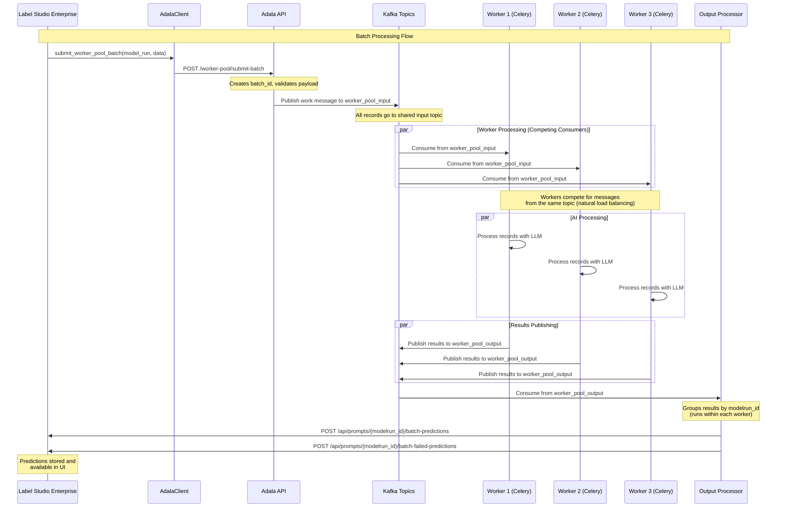

# Worker Pool Architecture

## Overview
The worker pool provides a scalable architecture for processing AI inference tasks from Label Studio Enterprise (LSE). It uses Kafka for message distribution and Celery workers for parallel processing.

## Architecture Flow



## System Components

### 1. Label Studio Enterprise (LSE)
- Initiates batch processing requests
- Receives predictions and failed predictions
- Manages model runs and projects

### 2. AdalaClient
- Interface between LSE and Adala API
- Handles payload preparation and error handling
- Located in `label_studio_enterprise.lse_ml_models.adala_client`

### 3. Adala API
- REST API endpoints for batch submission
- Publishes work directly to Kafka topics
- Provides status monitoring endpoints

### 4. Kafka Topics
- **Input Topic**: `worker_pool_input` - Shared topic where all work is published
- **Output Topic**: `worker_pool_output` - Shared results topic
- **Management Topics**: For coordination and monitoring

### 5. Celery Workers
- Forever-running consumer processes with integrated processors
- Each worker runs both WorkerProcessor and OutputProcessor via `celery_integration.py`
- WorkerProcessor consumes from shared input topic `worker_pool_input`
- Runs AI inference using configured models (OpenAI, Anthropic, etc.)
- Results are passed through internal async queue to OutputProcessor
- OutputProcessor sends results directly to LSE API

### 6. Output Processor
- Integrated within each Celery worker via `celery_integration.py`
- Consumes from shared output topic using internal async queue
- Groups results by `modelrun_id`
- Sends predictions back to LSE via API calls

## Key Features

### Scalability
- **Horizontal scaling**: Add more Celery workers as needed
- **Natural load balancing**: Workers compete for messages from shared input topic
- **Competing consumers**: Kafka automatically distributes messages across available workers

### Reliability
- **Error handling**: Failed predictions are tracked and reported separately
- **Graceful shutdown**: Workers handle shutdown signals properly
- **Monitoring**: Health checks and status endpoints available

### Flexibility
- **Model support**: Works with multiple AI providers (OpenAI, Anthropic, Vertex AI, etc.)
- **Batch processing**: Configurable batch sizes for optimal performance
- **Priority handling**: Support for different priority levels

## Usage Example

```python
from label_studio_enterprise.lse_ml_models.adala_client import AdalaClient

# Initialize client
client = AdalaClient()

# Submit batch for processing
result = client.submit_worker_pool_batch(model_run, data)

# Monitor batch status
status = client.get_worker_pool_batch_status(result['batch_id'])

# Check worker pool health
health = client.get_worker_pool_health()
```

## Configuration

Key settings that control worker pool behavior:
- `PROMPTER_ADALA_BATCH_SIZE`: Number of records per batch
- `PROMPTER_ADALA_NUM_WORKERS`: Number of Celery workers to run
- Kafka connection settings
- Model provider configurations

## Monitoring

The system provides monitoring through:
- Health checks via Celery worker status
- Logging throughout the processing pipeline
- Internal processor status tracking

## API Endpoints

### Submit Batch

**POST** `/worker-pool/submit-batch`

Submit a batch of records for processing.

**Request Body:**
```json
{
  "records": [
    {"text": "Sample text for processing"},
    {"text": "Another sample text"}
  ],
  "skills": [
    {
      "type": "ClassificationSkill",
      "name": "sentiment_classifier",
      "input_template": "Classify the sentiment: {text}",
      "field_schema": {
        "sentiment": {
          "type": "string",
          "enum": ["positive", "negative", "neutral"]
        }
      }
    }
  ],
  "runtime_params": {
    "type": "AsyncLiteLLMChatRuntime",
    "model": "gpt-3.5-turbo",
    "api_key": "your-api-key",
    "temperature": 0
  },
  "batch_size": 10,
  "priority": 1
}
```

**Response:**
```json
{
  "success": true,
  "data": {
    "batch_id": "batch_abc123_20250623_143000",
    "status": "submitted",
    "message": "Batch batch_abc123_20250623_143000 submitted successfully"
  }
}
```

### Monitoring

Monitoring is handled through:
- Celery worker logs and status
- Internal processor health tracking
- LSE API feedback for completed predictions

## Worker Integration

### Automatic Processor Startup

Each Celery worker automatically starts both processors via `celery_integration.py`:
- `WorkerProcessor`: Consumes from `worker_pool_input` topic
- `OutputProcessor`: Processes results and sends to LSE API
- Both run in the same worker process with shared async queue

### No Manual Consumer Tasks Needed

The system is fully integrated - no separate consumer tasks are required. All processing happens automatically within the Celery workers.

## Testing

### Quick Test

1. **Start the server:**
   ```bash
   python -m server.app
   ```

2. **Start Celery workers:**
   ```bash
   celery -A server.celery_app worker --loglevel=info --queues=default
   ```

3. **Submit test data via API:**
   ```bash
   # Use the submit-batch endpoint to send test data
   curl -X POST http://localhost:8000/worker-pool/submit-batch \
     -H "Content-Type: application/json" \
     -d '{"records": [{"text": "test"}], "skills": [...], "runtime_params": {...}}'
   ```

4. **Monitor worker logs:**
   ```bash
   # Check Celery worker logs to see processing activity
   # Results are automatically sent to LSE API
   ```

### Manual Testing

1. Submit a batch using the API endpoint
2. Monitor Celery worker logs for processing activity
3. Check LSE API for received predictions
4. Verify results appear in the Label Studio UI

## Benefits

- **Integrated Processing**: All processing happens within Celery workers - no separate consumers needed
- **Scalable**: Add more workers to increase processing capacity
- **Fault Tolerant**: Workers can fail and restart without losing work
- **Direct API Integration**: Results sent directly to LSE API without intermediate storage
- **Real-time Processing**: Immediate feedback to Label Studio UI

## Configuration

### Kafka Topics

- `worker_pool_input`: Shared topic for work distribution (50 partitions for load balancing)

### Environment Variables

Ensure these are set in your environment:
- `KAFKA_BOOTSTRAP_SERVERS`: Kafka server addresses
- `REDIS_URL`: Redis connection URL
- `CELERY_BROKER_URL`: Celery broker URL

## Troubleshooting

### Common Issues

1. **Kafka Connection Errors**: Check `KAFKA_BOOTSTRAP_SERVERS` configuration
2. **Worker Not Processing**: Ensure Celery workers are running and processors initialized
3. **No Results in LSE**: Check worker logs for API connection errors to LSE
4. **Import Errors**: Ensure all required packages are installed

### Debugging

1. Check Celery worker logs for processor initialization and errors
2. Monitor Kafka topics for message flow: `kafka-console-consumer --topic worker_pool_input`
3. Verify LSE API connectivity from worker environment
4. Check processor status via worker logs for last activity timestamps